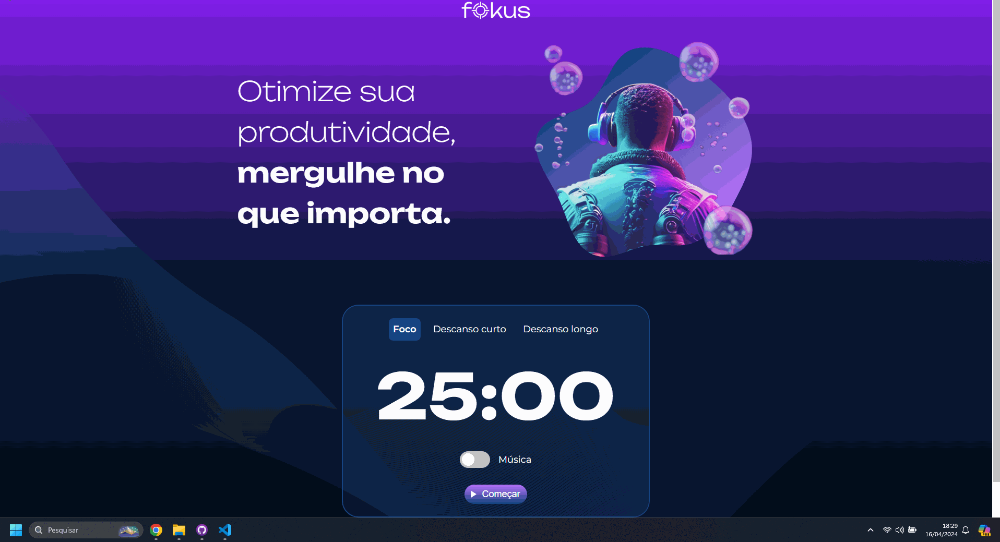

# Projeto Fokus

> Descrição

Este é um projeto construído em torno de um Contador, com o objetivo de ajudar o usuário a gerenciar seu tempo para focar em atividades específicas, 
bem como nos períodos de descanso curtos e longos. O projeto inclui alarmes sonoros ao término do tempo definido, e também toca uma música imersiva, 
tudo isso estilizado com diferentes tons e imagens que mudam conforme os cliques do mouse, e é totalmente responsivo.
Para desenvolver essa funcionalidade, utilizamos JavaScript para alterar dinamicamente o DOM do HTML, 
inserir e remover elementos, além de mudar imagens e cores. O relógio é exibido para o usuário, permitindo iniciar, 
pausar e zerar a contagem de forma intuitiva."

Projeto construído na aula do Curso de JavaScript Alura.

[🔗 Clique aqui para acessar o projeto](https://devdiegoalcantara.github.io/projeto-fokus)

## 🛠️ Tecnologias

- HTML
- CSS
- Javascript
- Git e GitHub

✉️ Contato

devdiegoalcantara@gmail.com
